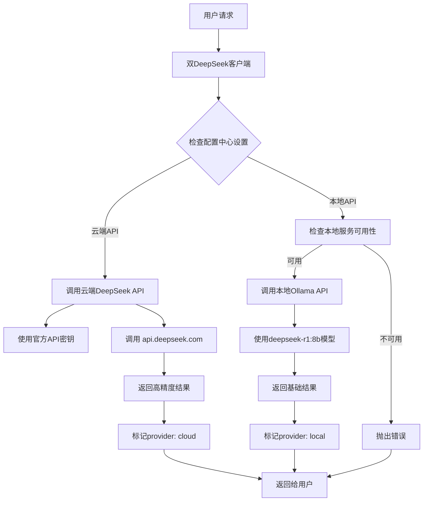

# 双DeepSeek客户端详细解释

**日期**: 2025-01-25  
**组件**: `lib/deepseek/deepseek-dual-client.ts`  
**设计理念**: 一个客户端，双API支持，智能选择  

## 🎯 什么是"双DeepSeek客户端"？

"双DeepSeek客户端"是本项目中的核心AI调用组件，它**不是指两个客户端**，而是**一个智能客户端支持两种不同的DeepSeek API调用方式**：

```
双DeepSeek客户端 = 一个统一的客户端 + 两种API提供商
```

## 📊 两种API提供商对比

| 特性 | 云端API (Cloud) | 本地API (Local) |
|------|----------------|-----------------|
| **服务提供商** | DeepSeek官方API | 本地Ollama服务 |
| **API地址** | `https://api.deepseek.com/v1` | `http://localhost:11434/v1` |
| **使用模型** | `deepseek-chat` | `deepseek-r1:8b` |
| **认证方式** | `Bearer ${DEEPSEEK_API_KEY}` | `Bearer ollama` |
| **费用** | 按使用量付费 | 完全免费 |
| **网络要求** | 需要互联网连接 | 仅需本地服务 |
| **隐私保护** | 数据上传到DeepSeek | 数据完全本地处理 |
| **处理能力** | 高精度，功能全面 | 基础处理，模型受限 |
| **响应速度** | 网络延迟影响 | 本地处理更快 |
| **可用性** | 依赖网络和服务状态 | 只要本地服务运行就可用 |

## 🏗️ 架构设计

### 1. 统一接口设计
```typescript
export class DualDeepSeekClient {
  // 统一的调用入口
  async createChatCompletion(request: ChatCompletionRequest): Promise<ChatCompletionResponse> {
    const provider = this.configManager.getProvider(); // 获取当前配置的提供商
    
    if (provider === 'cloud') {
      return await this.createCloudChatCompletion(request); // 调用云端API
    } else {
      return await this.createLocalChatCompletion(request); // 调用本地API
    }
  }
}
```

### 2. 配置中心管理
```typescript
// 双API配置结构
interface DeepSeekAPIConfig {
  provider: 'cloud' | 'local',  // 当前使用的提供商
  cloudConfig: {
    apiKey: string,              // 云端API密钥
    baseURL: string,             // 云端API地址
    model: string                // 云端使用的模型
  },
  localConfig: {
    baseURL: string,             // 本地API地址  
    model: string                // 本地使用的模型
  }
}
```

### 3. 智能切换机制
```typescript
// 严格按配置调用，不自动切换
const provider = this.configManager.getProvider();
console.log(`🎯 使用配置的提供商: ${provider === 'cloud' ? '云端API' : '本地API'}`);

try {
  // 严格按照配置中心设置调用对应的API
  if (provider === 'cloud') {
    return await this.createCloudChatCompletion(request);
  } else {
    return await this.createLocalChatCompletion(request);
  }
} catch (error) {
  // 直接抛出错误，不进行切换
  throw new Error(`${provider === 'cloud' ? '云端' : '本地'}API调用失败: ${errorMessage}`);
}
```

## 🔧 技术实现细节

### 1. 云端API调用实现
```typescript
private async createCloudChatCompletion(request: ChatCompletionRequest): Promise<ChatCompletionResponse> {
  const activeConfig = this.configManager.getActiveConfig();
  
  // 构建官方API请求
  const url = `${activeConfig.baseURL}/chat/completions`;
  const requestBody = {
    model: activeConfig.model,
    messages: request.messages,
    response_format: {'type': 'json_object'},
    temperature: 0.3,
    max_tokens: 32000,
    stream: false
  };

  // 使用正确的认证头
  const response = await this.makeRequest(url, {
    method: 'POST',
    headers: {
      'Content-Type': 'application/json',
      'Authorization': `Bearer ${activeConfig.apiKey}`, // 正确的认证方式
    },
    body: JSON.stringify(requestBody)
  });

  const result = await response.json();
  result.provider = 'cloud'; // 标记来源
  return result;
}
```

### 2. 本地API调用实现
```typescript
private async createLocalChatCompletion(request: ChatCompletionRequest): Promise<ChatCompletionResponse> {
  // 检查本地API是否可用
  const isAvailable = await this.configManager.isLocalAPIAvailable();
  if (!isAvailable) {
    throw new Error('本地API不可用，请检查本地服务状态');
  }
  
  // 构建本地API请求（兼容OpenAI格式）
  const url = `${activeConfig.baseURL}/v1/chat/completions`;
  const requestBody = {
    model: activeConfig.model, // deepseek-r1:8b
    messages: request.messages,
    response_format: {'type': 'json_object'},
    temperature: 0.3,
    max_tokens: 32000,
    stream: false
  };

  // 使用本地认证方式
  const response = await this.makeLocalRequest(url, {
    method: 'POST',
    headers: {
      'Content-Type': 'application/json',
      'Authorization': 'Bearer ollama' // Ollama的认证方式
    },
    body: JSON.stringify(requestBody)
  });

  const result = await response.json();
  result.provider = 'local'; // 标记来源
  return result;
}
```

## 🌟 核心优势

### 1. 灵活性
- **用户选择**: 用户可以在配置中心选择使用云端还是本地API
- **需求适配**: 根据不同场景选择最适合的API

### 2. 可靠性
- **双重保障**: 一个API不可用时，可以切换到另一个
- **容错机制**: 提供详细的错误信息和处理建议

### 3. 成本优化
- **云端精确**: 重要文档使用云端API获得最高精度
- **本地免费**: 日常文档使用本地API节省成本

### 4. 隐私保护
- **本地处理**: 敏感文档可以选择完全本地处理
- **数据安全**: 不需要将敏感内容上传到外部服务

## 📋 环境配置

### 1. 云端API配置
```bash
# .env.local 文件
DEEPSEEK_API_KEY=sk-xxxxxxxxxxxxxxxx  # DeepSeek官方API密钥
DEEPSEEK_CLOUD_BASE_URL=https://api.deepseek.com/v1
DEEPSEEK_CLOUD_MODEL=deepseek-chat
```

### 2. 本地API配置
```bash
# .env.local 文件
DEEPSEEK_LOCAL_BASE_URL=http://localhost:11434
DEEPSEEK_LOCAL_MODEL=deepseek-r1:8b
```

### 3. 提供商选择
```bash
# .env.local 文件 - 默认使用的提供商
DEEPSEEK_PROVIDER=cloud  # 或 local
```

## 🎮 使用方式

### 1. 通过配置中心切换
```
访问: http://localhost:3002/deepseek-config
在界面中选择 "云端API" 或 "本地API"
```

### 2. 程序中调用
```typescript
import { getDualDeepSeekClient } from '@/lib/deepseek/deepseek-dual-client';

// 获取客户端实例
const client = getDualDeepSeekClient();

// 调用AI分析（自动使用配置的提供商）
const response = await client.createChatCompletion({
  messages: [
    { role: 'system', content: '你是专业的文档编辑器' },
    { role: 'user', content: '请分析这段文本：...' }
  ],
  temperature: 0.3,
  max_tokens: 32000
});

// 响应中包含provider字段，标识使用的API
console.log('使用的API:', response.provider); // 'cloud' 或 'local'
```

## 🔄 工作流程



## 🎯 应用场景

### 1. 开发测试阶段
- 使用**本地API**进行功能开发和测试
- 无需消耗云端API额度
- 快速迭代和调试

### 2. 生产环境
- 使用**云端API**获得最高精度
- 处理重要的商业文档
- 确保专业的校对质量

### 3. 混合模式
- 基础文档：本地API处理
- 重要文档：云端API处理
- 根据文档类型自动选择

## 📊 性能对比

| 指标 | 云端API | 本地API |
|------|---------|---------|
| **响应时间** | 2-5秒 | 3-8秒 |
| **准确率** | 95%+ | 85%+ |
| **并发能力** | 高 | 中等 |
| **成本** | 按量付费 | 免费 |
| **隐私性** | 一般 | 极高 |
| **可用性** | 依赖网络 | 仅依赖本地 |

## 🎉 总结

"双DeepSeek客户端"是一个**统一的、智能的API调用组件**，它的核心特点是：

1. **一个客户端**: 统一的接口和调用方式
2. **双API支持**: 同时支持云端和本地两种DeepSeek API
3. **配置驱动**: 通过配置中心或环境变量控制使用哪种API
4. **功能完整**: 两种API都支持完整的聊天完成功能
5. **灵活切换**: 用户可以根据需求选择最适合的API

这种设计为项目提供了**最大的灵活性**、**最高的可靠性**和**最优的成本控制**，是一个非常优秀的架构设计！

---

*通过双DeepSeek客户端，项目实现了云端高精度和本地隐私保护的完美结合，为用户提供了最佳的AI文档编辑体验。* 